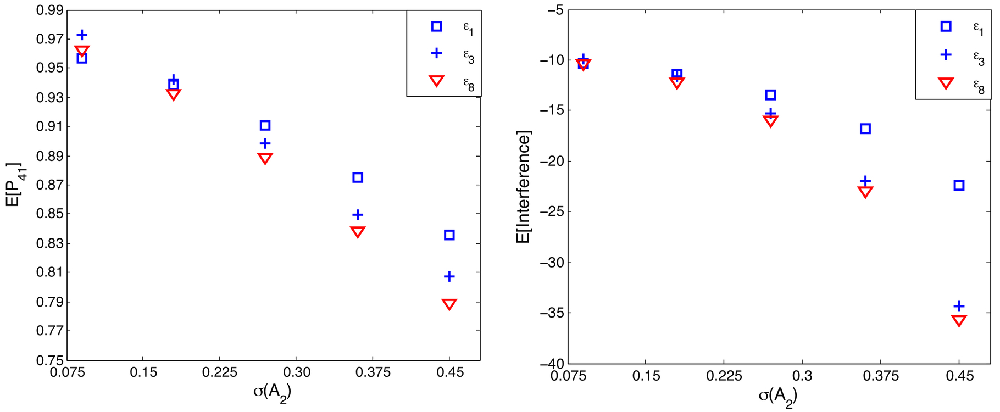

# RobustQC
MATLAB codes to determine the robustness of quantum control systems as described in https://doi.org/10.1103/PhysRevA.90.043414. 

## Output
The robust_amplitude_main.m file performs all the robustness calculations associated with the paper. It calls the input file containing parameters of the control field and various functions defined within the folder in order to generate outputs and their corresponding plots in the article.

```matlab
>>robust_amplitude_main

--------System and input parameters---------
loadfilenameopt: robust_calc_test_mod_field_1
H0:
    0.0010         0         0         0
         0    1.0000         0         0
         0         0    1.5000         0
         0         0         0    2.0000

mu:
     0     2     1     0
     2     0     0     2
     1     0     0     0
     0     2     0     0

finstate: 4
inistate: 1
sigma: 0.3         0.3         0.3
saveopt: 1
subsetsys: 0
upbndsys: 0
contind: 1
endind: 1
--------MI Analysis with full encoding---------
time consumed in amplitude MI: 431.1604
error in MI: 5.327e-15
----------Upper Bound Calculations skipped-----------
 
----------Robustness Calculations-----------
 
----------Interference Calculations-----------
order=[4,2], E[interf]=-16.4275, nom(interf)=-9.8615
order=[6,2], E[interf]=8.3684, nom(interf)=3.4052
order=[6,4], E[interf]=-12.8152, nom(interf)=-3.2711
order=[8,2], E[interf]=-2.5526, nom(interf)=-0.652
order=[8,4], E[interf]=4.3574, nom(interf)=0.6558
order=[8,6], E[interf]=-3.0266, nom(interf)=-0.25526
order=[10,2], E[interf]=0.5358, nom(interf)=0.080907
order=[10,4], E[interf]=-1.0016, nom(interf)=-0.084906
order=[10,6], E[interf]=0.74041, nom(interf)=0.033915
order=[10,8], E[interf]=-0.30241, nom(interf)=-0.0073054
...
order=[18,2], E[interf]=7.9453e-05, nom(interf)=1.0344e-06
order=[18,4], E[interf]=-0.00018775, nom(interf)=-1.2565e-06
order=[18,6], E[interf]=0.00015888, nom(interf)=5.4213e-07
order=[18,8], E[interf]=-7.0624e-05, nom(interf)=-1.2292e-07
order=[18,10], E[interf]=1.9664e-05, nom(interf)=1.7542e-08
order=[20,4], E[interf]=1.302e-05, nom(interf)=4.5046e-08
order=[20,6], E[interf]=-1.1195e-05, nom(interf)=-1.9722e-08
sum of nom(interf)= -1.5968
sum of E[interf]= -4.1111
 
------------Simulating Robustness------------
initial state(i): 1, final state(j): 4
P_{ji}: 0.96155
mean(U_{ji}: 0.3549-0.82581i
E[U_{ji}]: 0.35573-0.82207i
|E[U_{ji}]-mean(U_{ji})|:0.003838
mean(P_{ji}: 0.83751
E[P_{ji}]: 0.83328
|E[P_{ji}]-mean(P_{ji})|:0.0042295
variance(U_{ji}): 0.015402+0.014182i
\sigma^2(U_{ji}): 0.016324+0.014612i
|\sigma^2(U_{ji})-variance(U_{ji})|:0.0010179
time elapsed in simulated robustness: 9.1738
*****************end of analysis****************
\alpha: [0, 0, 2] \gamma: 3 |U_ji(T,\gamma)|^2: 0.52803
\alpha: [0, 0, 4] \gamma: 5 |U_ji(T,\gamma)|^2: 0.10174
\alpha: [0, 0, 6] \gamma: 7 |U_ji(T,\gamma)|^2: 0.0081138
\alpha: [0, 1, 1] \gamma: 25 |U_ji(T,\gamma)|^2: 0.1719
\alpha: [0, 1, 3] \gamma: 27 |U_ji(T,\gamma)|^2: 0.062717
\alpha: [0, 1, 5] \gamma: 29 |U_ji(T,\gamma)|^2: 0.0073045
\alpha: [0, 2, 0] \gamma: 47 |U_ji(T,\gamma)|^2: 0.013995
\alpha: [0, 2, 2] \gamma: 49 |U_ji(T,\gamma)|^2: 0.015767
\alpha: [0, 2, 4] \gamma: 51 |U_ji(T,\gamma)|^2: 0.0035249
\alpha: [1, 0, 1] \gamma: 531 |U_ji(T,\gamma)|^2: 1.0465
\alpha: [1, 0, 3] \gamma: 533 |U_ji(T,\gamma)|^2: 0.40401
\alpha: [1, 0, 5] \gamma: 535 |U_ji(T,\gamma)|^2: 0.04839
\alpha: [1, 0, 7] \gamma: 537 |U_ji(T,\gamma)|^2: 0.0028708
\alpha: [1, 1, 0] \gamma: 553 |U_ji(T,\gamma)|^2: 0.17035
\alpha: [1, 1, 2] \gamma: 555 |U_ji(T,\gamma)|^2: 0.1853
\alpha: [1, 1, 4] \gamma: 557 |U_ji(T,\gamma)|^2: 0.036093
\alpha: [1, 1, 6] \gamma: 559 |U_ji(T,\gamma)|^2: 0.0029225
\alpha: [1, 2, 1] \gamma: 577 |U_ji(T,\gamma)|^2: 0.031235
\alpha: [1, 2, 3] \gamma: 579 |U_ji(T,\gamma)|^2: 0.013958
\alpha: [1, 2, 5] \gamma: 581 |U_ji(T,\gamma)|^2: 0.0018283
\alpha: [1, 3, 2] \gamma: 601 |U_ji(T,\gamma)|^2: 0.0019865
...
\alpha: [6, 0, 0] \gamma: 3175 |U_ji(T,\gamma)|^2: 0.0078935
\alpha: [6, 0, 2] \gamma: 3177 |U_ji(T,\gamma)|^2: 0.0098529
\alpha: [6, 0, 4] \gamma: 3179 |U_ji(T,\gamma)|^2: 0.0021242
\alpha: [6, 1, 1] \gamma: 3199 |U_ji(T,\gamma)|^2: 0.002808
\alpha: [6, 1, 3] \gamma: 3201 |U_ji(T,\gamma)|^2: 0.0011898
\alpha: [7, 0, 1] \gamma: 3705 |U_ji(T,\gamma)|^2: 0.0028078
\alpha: [7, 0, 3] \gamma: 3707 |U_ji(T,\gamma)|^2: 0.0012107
>> 
```
| figure 1| figure 2| figure 3|
|---------|---------|---------|
||||

| figure 4| figure 5| figure 6|
|---------|---------|---------|
||||

## Special Notes
Specific details associated with the paper and worth mentioning for clarity are as follows:

Figure 2 can be obtained by running the robust_amplitude_main.m file at different sigmas and collecting the values of E[P_41] and E[interference] for plotting purposes. Note that the sigma (stdev) parameter is set in the input file “robust_calc_test_mod_field_[ind].mat” and this can be overwritten in the main file at the desired sigma values.

| figure 2| figure 3|
|---------|---------|
|||

Note that the interference plot generated by the file now includes the pathway interferences within the same order $m$, which is not the case in the submitted papers, i.e. Figure 3 only takes into account interferences between pathways of different orders.

In addition, the file includes calculations of data concerning:

1. The upper bounds of the terms C_ji^m, U_ji^m and P_ji^m
2. Display of numerical interference data,
3. Display of the significant encoded pathways, and 
4. The difference between moment- and sampled-calculations.

The files containing the control field parameters are given in the format “robust_calc_test_mod_field_[ind].mat”, where [ind] corresponds to indices of the field listed in Table II. Note that many of the examples uses input file with ind=1 and 8.



The figure 5 above can be obtained in the same way as the previous figure but, in this case, only the sigma of the second amplitude mode is varied while the other is kept at 0.3 as noted in the article.

The results of the robustness analysis obtained from running robust_amplitude_main.m file is called by poptransfer.m file to generate plot of control field and population transfer corresponding to the figure 6 below.


Table 4 in the paper corresponds to output values of the robust_amplitude_main.m file, which are also displayed at the end of each run which respect to an instance of sigma.


